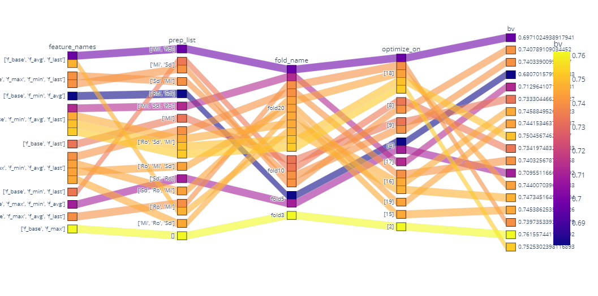
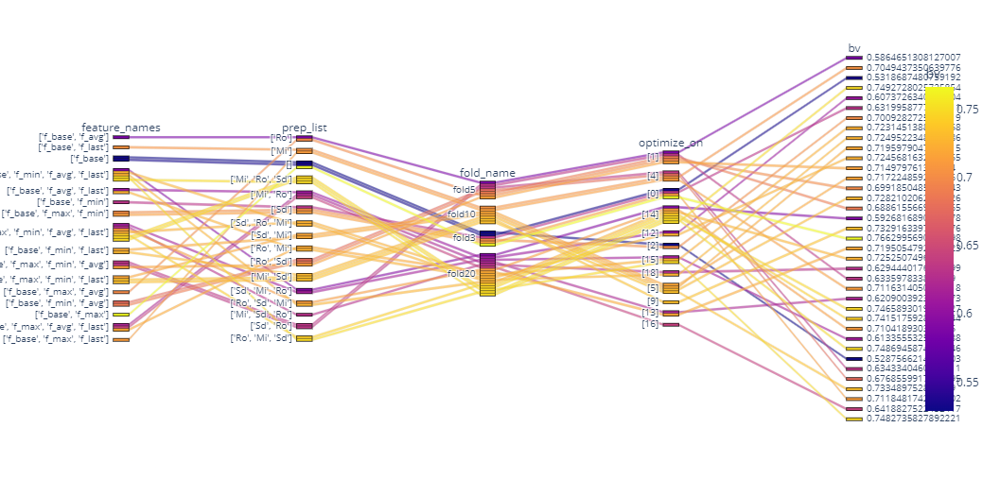
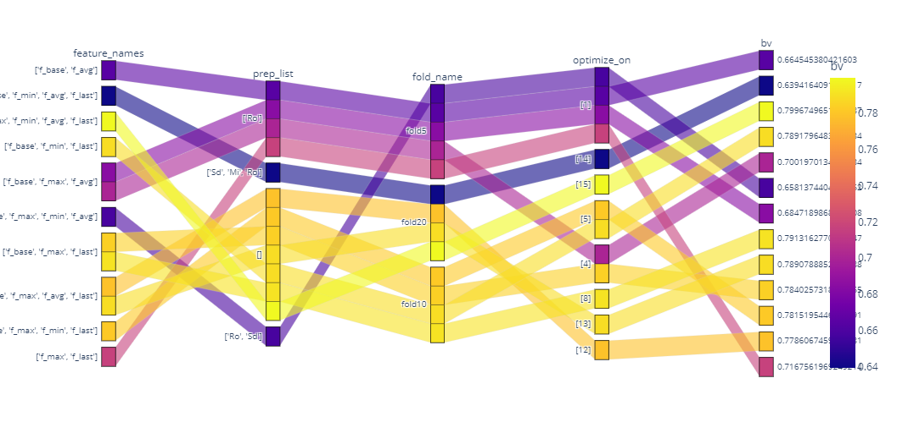
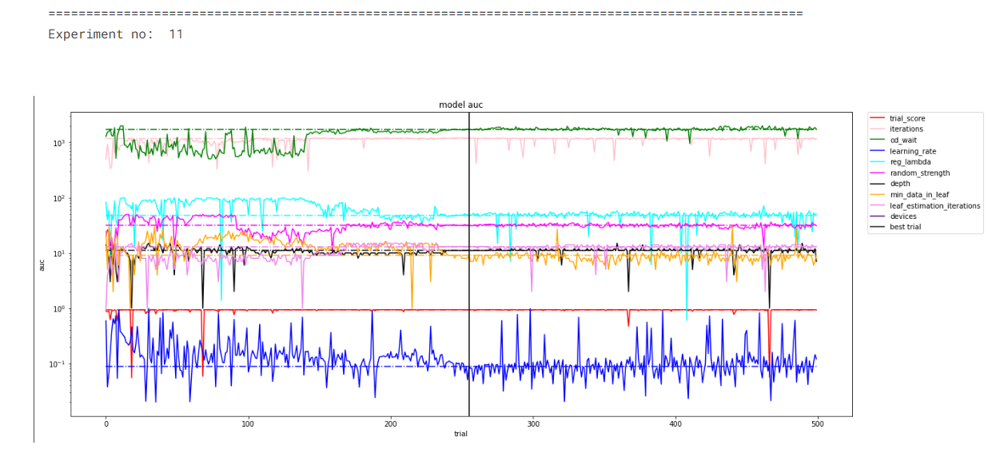
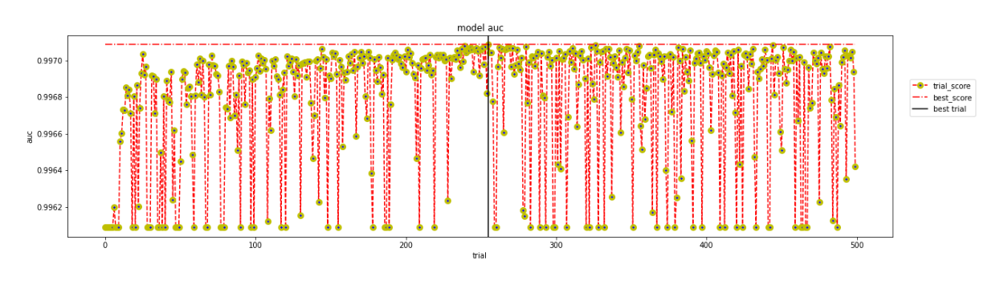
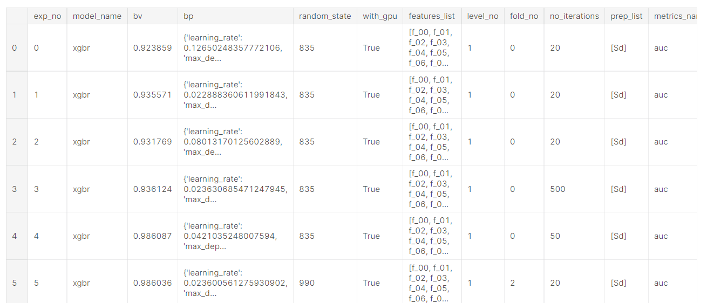

### [Framework3]
# Machine Learning Pipeline
The Pipeline is quite modular in nature following ```py37``` guidelines. This pipeline uses ```OOPs``` concepts which makes it quite robust and easy to debug.

I have tried to make this pipeline not too abstract, thus all the controls will be in hand of the user. It will just help automate repetative tasks like creating folds, creating OOF and TEST predictions from an experiment.
## Features 
### 1.Visualize Experimentations
> Visualize effect of various feature groups and and preprocessing techniques on the score.

<p>
    
</p>
<p>
    
</p>
<p>
    
</p>

> Visualize how various algorithms [here ```optuna```] does hyperparameter tuning through various trials.<br>
Demo: https://www.kaggle.com/code/raj401/eda-experiments-tmay

<p>
    
</p>
<p>
    
</p>

### 2.Automates Hyperparameter tuning, experimentation, OOF and TEST predictions.<br>
Demo: https://www.kaggle.com/code/raj401/inference-mnist
```
!python experiment.py
!python predict.py
!python output.py
```
### 3.Maintains a table of all the experiments.
<p>
    
</p>

# How to use it
## Environment setup
Change your working directory to `src_framework3`. 
```
src_framework3
├── create_folds.py
├── custoom_classes.sh
├── custom_models.py
├── experiment.py
├── feature_generator.py
├── feature_picker.py
├── grab.py
├── info.txt
├── keys.py
├── metrics.py
├── model_dispatcher.py
├── optuna_search.py
├── output.py
├── predict.sh
├── ref.txt
├── run.sh
└── utils.py

```
### Dependencies
Install below libraries manually or run command `sh run.sh`.<br>
Note: to run the `sh` script make sure your current working directory is `ars_src`
```
pip install optuna
pip install catboost
pip install timm
pip install pretrainedmodels
pip install -Iv tez==0.6.0
pip install torchcontrib
pip install iterative-stratification
```
### TABULAR COMPETITION (classification/regression)
#### [STEPS]
> STEP-->1 : First set ref

> STEP-->2 : run init_folders.py --> create_datasets.py 

>STEP-->3 : put train.parquet, test.parquet, sample.parquet in input folder 
    [requirement] train:- id_col, features, target ( train may or may not have id column but test must have id column)
    [if not in parquet then convert using csv_to_parquet.py]
    [Now see once input content train, sample, test using show_input.py]
    test:- id_col, features 
    sample:- id_col, target 

>STEP-->4 : run keys.py

>STEP-->5 : run create_folds.py
    [ Create New id columns for train]
    [ No need to sort test as test will always have submission with id column just never RESHUFFLE]
    [ Sort train by id column, if not create one by reshuffling since when we get folds we will also sort them]
    [No need to sort test, we just predict on them, no training]

##### train--------[ converted to ]------------->my_folds
```
After this what should we have these files in input folder
    # what we did is train------------------->my_folds
    my_folds:- id_col, features, target , fold_cols
    test:- id_col, features  
    sample:- id_col, target_col 

    [You may now remove train folder]
    check once everything is as it should be using show_input.py 
```  
> STEP-->6 : run experiment.py / auto_exp.py # we should pass list of optimize_on  in run()
            We won't be predicting for all the experiments we do. So keep log_exp_22.pkl file in a subfolder
            also make seperate folder for preds: oof_preds, test_preds 
            # After 5-6 hr do plot the auto table to see which set performs well and you can limit the search in that direction 
            # Like "f_base", "f_max" performs quite well 
            
> STEP-->7 : run predict.py  or run seed_it.py # calls opt() function but not run() so keep it that way as obj() don't require optimize_on
            Note : run() takes list optimize_on 
                 : obj() takes single integer optimize_on for each fold 
                 : both takes fold_name
                 
> STEP-->8 : run output.py after running predict.py 

> STEP-->9 : make submission

```
submit.py 
    kaggle competitions list
    kaggle competitions leaderboard amex-default-prediction --show | --download
    kaggle competitions submisssions amex-default-prediction 
    kaggle competitions submit ventilator-pressure-prediction -f submission.csv -m "exp_{}_fold/single/all" #submit your submission.csv
Note: all parquet file contains id and target , all pkl files contain 1d prediction
```        

> STEP-->10 : auto_exp , It automatically does experimentations by selecting different subsets of feature groups and preprocessing techniques.

### IMAGE COMPETITION (classification)
#### [STEPS]
##### [Case1] Image stored as dataframe
> STEP-->1 : First set ref [note: image_df: image pixels are stored as dataframe ]

> STEP-->2 : move train.csv ,test.csv, sample.csv to models_  [make name train,test,sample]

> STEP-->3 :decide: <br>
id_name : as that of train id columns <br>
target_name : as that of sample target column 

```
-----------Make format like below exactly ----------------------
train: ImageId, Label, pixel0, pixel1, pixel2, ... , pixel200,  
test: ImageId, pixel0, pixel1, pixel2, ... , pixel200 
sample: ImageId, Label
```

> STEP-->4 :run keys.py after setting appropriate name of variables
> STEP-->5 :run create_folds.py to create [my_folds.csv]

##### [Case1] Image path stored in dataframe<br>
image_path: there is train.csv and sample.csv folder which contains image name and there are image folders
```
initially>
(before putting image ID column do sample(frac=1))
train.csv: image_id, target 
sample.csv: image_id, fake_target
target_name >> sample target name 
id_name >> sample id name 
```

> STEP-->1 : move train.csv to models_ by first rename id_name to  image1.jpeg 

> STEP-->2 : move sample.csv to models_ as test.csv by first renaming id_name to image2.jpeg 

> STEP-->3 : move sample to models_ [image_id, target]

> STEP-->4 : run keys.py after setting appropriate name of variables

> STEP-->5 : run create_folds.py to create [my_folds.csv]

##### [Case3] Image Folder ..[work in progress..]


